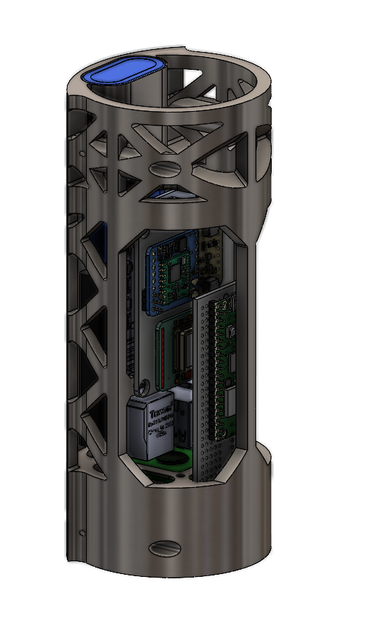

# relay

<div>
    <div style="float:left;">
        
    </div>
    An MVP for a processing chain to enable multi sensor acquisition and multi actuator control on a robotic system. Services are currently built around the MAch24 competition use case running an agricultural monitoring system via a Raspberry Pi HQ camera and a Pix2Pix CGAN model to transform RGB images to NIR images for NDVI and NDWI analysis for crop health monitoring along with telemetry and odometry requirements for safe and legal high powered rocket flight as a CanSat component.
</div>


## Installation

```bash
git clone https://github.com/ULAS-HIPR/relay.git 
cd relay
```

## Usage

Below is the shotgun approach to deploying all services. For individual service deployment, see the service READMEs.

```bash
chmod +x ./deploy.sh 
./deploy.sh # Deploy and start all services

chmod +x ./quit.sh
./quit.sh # Stop all services
```


## Services

| Name | Docs | Description | Tools | Status |
|------|---------|-------------|--------|--------|
| sat_agrinet | [agrinet](agrinet/README.md) | CGAN Inference for NIR -> RGB Synthetic Image Generation | Python, PyInstaller | Ready for Test |
| sat_camera | [camera](camera/README.md) | Camera Capture and Image Storage | Bash, libcamera | Ready for Test |
| sat_telemetry | ... | ... | C++, Make g++ | Unsupported |
| sat_odometry | ... | ... | C++, Make, g++ | Unsupported |